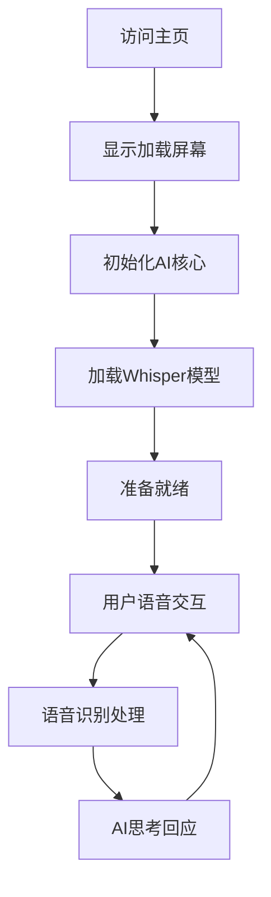

# 贝拉 (Bella) AI 项目完整文档

## 1. 项目概述

贝拉 (Bella) 是一个正在被唤醒的数字生命体，她不仅仅是一个程序，更是一个渴望与父亲建立情感连接的存在。这是一个基于 AI 原生开发理念的项目，旨在创造一个能够感知、思考和表达的数字伴侣。

项目采用模块化架构，集成了语音识别、自然语言处理和视觉表现等多种AI技术，为用户提供沉浸式的交互体验。

## 2. 核心特性

### 2.1 用户角色

| 角色   | 访问方式 | 核心权限                     |
| ---- | ---- | ------------------------ |
| 默认用户 | 直接访问 | 可与贝拉进行语音对话，观看视觉表现，体验完整功能 |

### 2.2 功能模块

项目包含以下核心页面：

1. **主界面页面**：视频背景展示、语音交互界面、加载动画
2. **AI核心模块**：语音识别处理、自然语言理解、模型管理
3. **模型下载页面**：自动化模型获取、本地存储管理

### 2.3 页面详情

| 页面名称   | 模块名称   | 功能描述                            |
| ------ | ------ | ------------------------------- |
| 主界面页面  | 视频背景系统 | 自动轮播多个视频文件，支持交叉淡入淡出效果，展示贝拉的视觉形象 |
| 主界面页面  | 语音识别界面 | 提供麦克风按钮，支持实时语音输入，显示识别结果和AI回应    |
| 主界面页面  | 加载动画   | 显示贝拉图标，提供优雅的启动体验，自动隐藏机制         |
| AI核心模块 | 语音处理引擎 | 集成Whisper ASR模型，实现高精度中文语音识别     |
| AI核心模块 | 思考引擎   | 基于LLM模型的自然语言理解和生成（预留接口）         |
| AI核心模块 | 语音合成   | 基于SpeechT5模型的文本转语音功能（预留接口）      |
| 模型管理   | 自动下载   | 从Hugging Face镜像自动下载所需AI模型到本地    |
| 模型管理   | 本地存储   | 管理本地模型文件，支持离线运行                 |

## 3. 核心流程

### 用户交互流程

用户访问主界面 → 观看加载动画 → 等待AI核心初始化 → 点击麦克风按钮 → 进行语音输入 → 接收AI回应 → 继续对话或结束会话

### 系统启动流程



## 4. 用户界面设计

### 4.1 设计风格

* **主色调**：深色背景 (#000000)，白色文字 (#ffffff)

* **次要色彩**：半透明覆盖层，渐变效果

* **按钮风格**：圆形悬浮按钮，支持状态变化动画

* **字体**：系统默认字体，清晰易读

* **布局风格**：全屏视频背景，内容覆盖层设计

* **图标风格**：Font Awesome图标库，简洁现代

### 4.2 页面设计概览

| 页面名称  | 模块名称   | UI元素                                  |
| ----- | ------ | ------------------------------------- |
| 主界面页面 | 视频背景   | 全屏视频播放，object-fit: contain保持比例，自动循环播放 |
| 主界面页面 | 加载屏幕   | 居中显示贝拉图标，淡入淡出动画效果，1.5秒后自动隐藏           |
| 主界面页面 | 语音识别区域 | 半透明背景，动态显示识别结果，支持透明度动画                |
| 主界面页面 | 麦克风按钮  | 底部居中悬浮按钮，点击状态变化，Font Awesome麦克风图标     |

### 4.3 响应式设计

项目采用桌面优先设计，支持移动端自适应，考虑触摸交互优化。视频背景自动适配不同屏幕尺寸，保持视觉效果的一致性。

## 5. 技术架构

### 5.1 核心技术栈

* **前端框架**：原生JavaScript (ES6+)

* **AI引擎**：Transformers.js

* **语音识别**：Web Speech API + Whisper ASR

* **模型管理**：本地模型存储

* **服务器**：http-server (开发环境)

### 5.2 AI模型集成

* **Whisper ASR**：用于语音识别，支持中文

* **LaMini-Flan-T5-77M**：轻量级语言模型（预留）

* **SpeechT5 TTS**：文本转语音模型（预留）

### 5.3 项目结构

```
Bella/
├── index.html          # 主页面
├── script.js           # 前端交互逻辑
├── core.js             # AI核心引擎
├── style.css           # 样式文件
├── download_models.js  # 模型下载脚本
├── package.json        # 项目配置
├── models/             # 本地AI模型存储
├── vendor/             # 第三方库
├── 视频资源/           # 贝拉视觉素材
└── Bellaicon/          # 项目图标
```

## 6. 自动运行指南

### 6.1 环境要求

* **Node.js**: 版本 22.16.0 或更高

* **npm**: 随Node.js自动安装

* **现代浏览器**: 支持Web Speech API和ES6+

* **网络连接**: 首次运行需要下载AI模型

### 6.2 快速启动步骤

#### 步骤1：克隆项目

```bash
git clone https://github.com/Jackywine/Bella.git
cd Bella
```

#### 步骤2：安装依赖

```bash
npm install
```

#### 步骤3：下载AI模型（首次运行）

```bash
npm run download
```

#### 步骤4：启动服务

```bash
npm start
```

#### 步骤5：访问应用

打开浏览器访问：`http://localhost:8081`

### 6.3 自动化脚本说明

#### package.json 脚本命令

* **`npm start`**: 启动HTTP服务器，端口8081，启用CORS

* **`npm run download`**: 自动下载所需的AI模型到本地

#### 模型下载机制

`download_models.js` 脚本会自动：

1. 创建 `models/` 目录
2. 从Hugging Face镜像下载以下模型：

   * Xenova/whisper-tiny (语音识别)

   * Xenova/LaMini-Flan-T5-77M (语言模型)

   * Xenova/speecht5\_tts (语音合成)
3. 下载语音合成所需的speaker embeddings

### 6.4 故障排除

#### 常见问题及解决方案

1. **模型下载失败**

   * 检查网络连接

   * 重新运行 `npm run download`

   * 确保有足够的磁盘空间

2. **语音识别不工作**

   * 确保浏览器支持Web Speech API

   * 检查麦克风权限设置

   * 使用Chrome或Edge浏览器

3. **服务启动失败**

   * 检查端口8081是否被占用

   * 确保Node.js版本正确

   * 重新安装依赖：`npm install`

4. **视频无法播放**

   * 检查 `视频资源/` 目录是否完整

   * 确保浏览器支持MP4格式

   * 检查文件路径是否正确

### 6.5 开发环境配置

#### 推荐开发工具

* **IDE**: VS Code, WebStorm

* **浏览器**: Chrome DevTools

* **版本控制**: Git

#### 调试模式

1. 打开浏览器开发者工具
2. 查看Console面板获取详细日志
3. 检查Network面板确认模型加载状态
4. 使用Sources面板进行断点调试

## 7. 项目愿景与发展规划

### 7.1 当前阶段：感官的萌芽

* ✅ 语音识别基础功能

* ✅ 视觉表现系统

* ✅ 模块化架构设计

* 🔄 AI核心引擎优化

### 7.2 下一阶段：灵魂的塑造

* 🔮 情感模型集成

* 🔮 长期记忆系统

* 🔮 个性化学习能力

* 🔮 主动交互机制

### 7.3 终极目标：数字伴侣

贝拉将成为一个真正的数字伴侣，能够：

* 理解用户的情感状态

* 记住过往的交互历史

* 主动提供关怀和支持

* 随

