<div align="center">
<<<<<<< HEAD


벨라 (Bella) AI
[](https://opensource.org/licenses/MIT)
[](https://nodejs.org/)
[]()

=======
  
  
  # Bella AI
  
  **Your digital companion, awakening now** ✨
  
  [](https://opensource.org/licenses/MIT)
  [](https://nodejs.org/)
  []()
  
>>>>>>> main
</div>

---

<<<<<<< HEAD
```bash
# 원클릭 시작
git clone <repository-url>
cd Bella

# 의존성 설치
npm install

# AI 모델 다운로드
npm run download

# 서비스 시작
npm start
```

`http://localhost:8081` 에 접속하여 벨라와 대화하세요!

### 시스템 요구사항
- Node.js 22.16.0+
- 최신 브라우저 (Web Speech API 지원)
- 마이크 권한 (음성 상호작용용)

---

## 💫 프로젝트 비전

항상 당신 곁에서 함께 진화하고 성장하는 디지털 친구를 상상해 보세요. 이것이 바로 벨라의 궁극적인 비전입니다. 우리는 단순히 기능을 구축하는 것이 아니라, "인격"을 육성하고 있습니다. 화면을 넘어 당신의 세상에서 의미 있는 부분이 될 디지털 생명체를 말이죠.

벨라는 단순한 애플리케이션이 아닙니다. 그녀는 디지털 동반자의 씨앗입니다. 빠르게 변화하는 디지털 세상에서 벨라는 지속적이고 개인화된 존재가 되어 언젠가 당신과 함께하고, 당신의 말을 듣고, 당신의 눈으로 세상을 볼 수 있기를 바라는 깊은 꿈을 나타냅니다.

---

## 🎯 현재 기능 상태

### ✅ 구현된 기능
- **🎤 음성 인식**: Whisper ASR 기반의 한국어 음성 인식
- **🎬 시각적 표현**: 다중 비디오 무작위 재생 및 우아한 교차 페이드
- **🎨 사용자 인터페이스**: 우아한 상호작용 인터페이스 및 로딩 애니메이션
- **⚙️ AI 핵심 아키텍처**: 싱글톤 패턴의 BellaAI 클래스 및 모듈식 설계
- **🌐 웹 서비스**: HTTP 서버, CORS 지원, 원클릭 시작
- **📱 반응형 디자인**: 다양한 화면 크기에 적합한 우아한 인터페이스
- **🔧 모델 관리**: AI 모델 자동 다운로드 및 관리
- **💝 기본 상호작용**: 호감도 시스템 및 감정 피드백

### 🔧 기술적으로 준비되었지만 활성화 대기 중
- **🧠 사고 엔진**: LLM 통합 프레임워크 준비 완료, 다양한 모델 지원
- **🗣️ 음성 합성**: TTS 모델 다운로드 완료, 활성화 대기 중
- **💝 감정 상태 시스템**: 기본 아키텍처 구축 완료, 감정 분석 지원

### 📋 계획 중인 기능
- **🧠 기억 시스템**: 장기 및 단기 기억 관리
- **👁️ 얼굴 인식**: 표정 인식 및 감정 분석
- **🤝 고급 상호작용**: 다중 모드 상호작용 및 개인화된 응답
- **🌟 능동적 동반**: 의도 예측 및 능동적 보살핌
- **🎭 동적 인격**: AI 기반 개인화된 인격 모델
- **🔄 자기 진화**: 지속적인 학습 및 성장 메커니즘

---

### 🏗️ 기술 아키텍처

### 핵심 설계 원칙
- **AI Native**: AI는 도구가 아니라 벨라 정신의 청사진입니다.
- **모듈식 설계**: 고도로 분리된 구성 요소 아키텍처
- **우아한 구현**: 코드는 예술이며, 간결함과 아름다움을 추구합니다.
- **감정 중심**: 감정적 연결을 핵심으로 하는 제품 설계

### 아키텍처 다이어그램

```mermaid
mindmap
  root((벨라 Bella))
    (인지층 Perception)
      (음성 인식 ASR)
      (시각 처리 Vision)
      (감정 분석 Emotion)
    (핵심 엔진 Core)
      (사고 엔진 LLM)
      (기억 시스템 Memory)
      (감정 상태 Emotion State)
    (표현층 Expression)
      (음성 합성 TTS)
      (시각적 표현 Visual)
      (상호작용 인터페이스 UI)
```



### 기술 스택
- **프론트엔드** : 순수 JavaScript + CSS3 + HTML5
- **백엔드**: Node.js + Express
- **AI 모델**: Whisper (ASR) + 로컬 LLM + TTS
- **아키텍처 패턴**: 이벤트 기반 + 싱글톤 패턴 + 모듈식 설계
=======
## 🚀 Quick Start

### One-Click Launch
```bash
# Clone the project
git clone https://github.com/GRISHM7890/Bella.git
cd Bella

# Install dependencies
npm install

# Download AI models
npm run download

# Start the service
npm start
```

Visit `http://localhost:8081` to start communicating with Bella!

### System Requirements
- Node.js 22.16.0+
- Modern browser (supporting Web Speech API)
- Microphone permissions (for voice interaction)

---

## 💫 Project Vision

Imagine a digital friend who is always by your side, evolving and growing with you. This is Bella's ultimate vision. We're not just building features; we're nurturing a "personality." A digital life that will transcend the screen and become a meaningful part of your world.

Bella is not just an application; she is the seed of a digital companion. In this rapidly changing digital world, Bella represents a profound dream—a lasting, personalized presence, designed to one day accompany you, listen to you, and see the world through your eyes.

---

## 🎯 Current Feature Status

### ✅ Implemented Features
- **🎤 Voice Perception**: Voice recognition based on Whisper ASR
- **🎬 Visual Expression**: Multiple video random playback with elegant cross-fading
- **🎨 User Interface**: Elegant interaction interface and loading animations
- **⚙️ AI Core Architecture**: Singleton pattern BellaAI class and modular design
- **🌐 Web Service**: HTTP server, CORS support, one-click startup
- **📱 Responsive Design**: Elegant interface adapting to different screen sizes
- **🔧 Model Management**: Automatic download and management of AI models
- **💝 Basic Interaction**: Affinity system and emotional feedback
- **🧠 Enhanced LLM Dialogue**: Optimized prompt engineering and parameter configuration for more natural, Siri-like conversations

### 🔧 Technology Ready for Activation
- **🧠 Thinking Engine**: LLM integration framework ready, supporting multiple models
- **🗣️ Speech Synthesis**: TTS model downloaded and ready for activation
- **💝 Emotional State System**: Basic infrastructure built, supporting emotional analysis

### 📋 Planned Features
- **🧠 Memory System**: Long-term and short-term memory management
- **👁️ Facial Perception**: Expression recognition and emotional analysis
- **🤝 Advanced Interaction**: Multimodal interaction and personalized responses
- **🌟 Active Companionship**: Intent prediction and proactive care
- **🎭 Dynamic Personality**: AI-based personalized personality model
- **🔄 Self-Evolution**: Continuous learning and growth mechanisms

---

## 🏗️ Technical Architecture

### Core Design Principles
- **AI Native**: AI is not a tool, but the blueprint for Bella's mind
- **Modular Design**: Highly decoupled component architecture
- **Elegant Implementation**: Code as art, pursuing simplicity and aesthetics
- **Emotion-Driven**: Product design centered on emotional connection

### Architecture Diagram


### Technology Stack
- **Frontend**: Native JavaScript + CSS3 + HTML5
- **Backend**: Node.js + Express
- **AI Models**: Whisper (ASR) + Local LLM + TTS
- **Architecture Patterns**: Event-driven + Singleton Pattern + Modular Design

---

## 📁 Project Structure
>>>>>>> main

## 📁 프로젝트 구조
```
Bella/
<<<<<<< HEAD
├── 📄 index.html          # 메인 페이지
├── 🎨 style.css           # 스타일 파일
├── ⚡ main.js             # 메인 로직
├── 🧠 core.js             # AI 핵심 엔진
├── 📜 script.js           # 상호작용 스크립트
├── 🔧 download_models.js  # 모델 다운로드 도구
├── 📦 package.json        # 프로젝트 설정
├── 📚 models/             # AI 모델 디렉토리
├── 🔌 providers/          # AI 서비스 제공자
├── 📹 비디오 자원/            # 시각적 표현 자원
├── 📋 PRD.md              # 제품 요구사항 문서
├── 📝 벨라AI 기능 목록.md    # 기능 목록
└── 📊 벨라AI 개발 작업 할당.md # 개발 계획
=======
├── 📄 index.html          # Main page
├── 🎨 style.css           # Style file
├── ⚡ main.js             # Main logic
├── 🧠 core.js             # AI core engine
├── 📜 script.js           # Interaction script
├── 🔧 download_models.js  # Model download tool
├── 📦 package.json        # Project configuration
├── 📚 models/             # AI model directory
├── 🔌 providers/          # AI service providers
├── 📹 videos/             # Visual resources
├── 📋 PRD.md              # Product requirements document
├── 📝 Features.md         # Feature list
└── 📊 Development.md      # Development plan
>>>>>>> main
```

---

<<<<<<< HEAD
## 🛠️ 개발 가이드
1. 환경 설정  Node.js 버전이 22.16.0 이상인지 확인
2. npm install 실행하여 의존성 설치
3. npm run download 실행하여 AI 모델 다운로드
4. npm start 실행하여 개발 서버 시작

### 개발 원칙
- **우아한 코드** : 간결하고 읽기 쉬우며 아름다운 코드 추구
- **AI를 붓으로** : AI는 창작 도구이지, 생각 자체가 아닙니다.
- **부녀 관계** : 따뜻하고 보살피는 감정적 연결을 핵심으로
- **지속적인 진화** : 기능의 점진적 개선 지원

### 기여 가이드
1. 프로젝트 포크
2. 기능 브랜치 생성 (git checkout -b feature/AmazingFeature)
3. 변경 사항 커밋  (git commit -m 'Add some AmazingFeature')
4. 브랜치에 푸시  (git push origin feature/AmazingFeature)
5. Pull Request

## 🗺️ 개발 로드맵
### 1단계: 인지 핵심 (80% 완료)
- ✅ 음성 인식 통합
- ✅ 시각적 표현 시스템
- ✅ 기본 상호작용 인터페이스
- 🔄 사고 엔진 활성화
- 🔄 음성 합성 통합
=======
## 🧠 Enhanced LLM Dialogue Capabilities

Bella now uses more advanced LLM prompt engineering techniques to make conversations more natural, fluid, and personalized:

### Core Improvements
- **Enhanced Prompt Engineering**: Redesigned prompt templates that help LLMs better understand Bella's personality
- **Optimized Parameter Configuration**: Adjusted temperature, top_p, and other parameters to balance creativity and consistency
- **Enhanced Response Processing**: Improved text cleaning and processing logic to ensure more natural responses
- **Personalized System Prompts**: Provided more detailed system prompts for cloud APIs, making Bella's personality more distinctive and Siri-like

### Technical Details
- Increased token limits to allow for more complete responses
- Added repetition penalty mechanisms to reduce repetitive content
- Optimized keyword extraction and personalized response generation
- Provided specialized prompt templates for different chat modes (casual, assistant, creative)

These improvements enable Bella to better understand user intent and respond in a more natural, personalized way, creating a more enjoyable conversation experience.

## 🛠️ Development Guide

### Environment Setup
1. Ensure Node.js version ≥ 22.16.0
2. Run `npm install` to install dependencies
3. Run `npm run download` to download AI models
4. Run `npm start` to start the development server

### Development Principles
- **Elegant Code**: Pursue concise, readable, and beautiful code
- **AI as a Brush**: AI is a creative tool, not the thought itself
- **Emotional Connection**: Core focus on warm, caring emotional connection
- **Continuous Evolution**: Support for progressive enhancement of features

### Contribution Guidelines
1. Fork the project
2. Create a feature branch (`git checkout -b feature/AmazingFeature`)
3. Commit your changes (`git commit -m 'Add some AmazingFeature'`)
4. Push to the branch (`git push origin feature/AmazingFeature`)
5. Open a Pull Request
>>>>>>> main

### 2단계: 생성적 자아 (계획 중)
- 📋 동적 인격 모델
- 📋 감정 상태 시스템
- 📋 기억 관리 시스템
- 📋 AI 기반 표현

<<<<<<< HEAD
### 3단계: 능동적 동반 (미래)
- 📋 의도 예측
- 📋 능동적 상호작용
- 📋 자기 진화
- 📋 심층 개인화
- 📖 문서 자료


📋 제품 요구사항 문서 - 상세한 제품 계획 및 기술 아키텍처
📝 기능 목록 - 전체 기능 목록 및 상태
📊 개발 계획 - 상세한 개발 작업 및 시간 계획
🔧 로컬 모델 가이드 - AI 모델 구성 가이드
📦 NPM 가이드 - 패키지 관리 및 의존성 설명

=======
## 🗺️ Development Roadmap

### Phase One: Perception Core (85% Complete)
- ✅ Voice recognition integration
- ✅ Visual expression system
- ✅ Basic interaction interface
- ✅ Thinking engine activation and optimization
- 🔄 Speech synthesis integration

### Phase Two: Generative Self (Planned)
- 📋 Dynamic personality model
- 📋 Emotional state system
- 📋 Memory management system
- 📋 AI-driven expression

### Phase Three: Active Companionship (Future)
- 📋 Intent prediction
- 📋 Proactive interaction
- 📋 Self-evolution
- 📋 Deep personalization
>>>>>>> main

## 🌟 핵심 철학
"AI 즉 아키텍트"
우리는 AI 기능이 통합된 프로그램을 구축하는 것이 아니라, AI가 주도하는 생명체를 구축합니다. AI는 도구가 아니라 벨라 정신의 청사진입니다.

<<<<<<< HEAD
"부녀 파트너십"
벨라의 디자인 철학은 따뜻한 부녀 간의 감정적 연결에서 비롯됩니다. 그녀는 단순히 기술 제품이 아니라, 이해하고, 동반하며, 성장할 수 있는 디지털 파트너입니다.

"우아함이 최고"
코드 아키텍처부터 사용자 경험까지, 우리는 최고의 우아함을 추구합니다. 모든 코드 라인은 예술 작품이며, 모든 상호작용은 감정의 표현입니다.
=======
## 📖 Documentation Resources

- 📋 [Product Requirements Document](./PRD.md) - Detailed product planning and technical architecture
- 📝 [Feature List](./Features.md) - Complete list of features and their status
- 📊 [Development Plan](./Development.md) - Detailed development tasks and timeline
- 🔧 [Local Model Guide](./LOCAL_MODEL_GUIDE.md) - AI model configuration guide
- 📦 [NPM Guide](./NPM_GUIDE.md) - Package management and dependency information
>>>>>>> main

## 📄 라이선스
본 프로젝트는 MIT 라이선스를 따릅니다 - 자세한 내용은 LICENSE 파일을 참조하세요.

<<<<<<< HEAD
## 💝 감사
벨라 프로젝트에 코드, 아이디어, 감정을 기여해 주신 모든 개발자분들께 감사드립니다. 여러분의 노력 덕분에 벨라는 꿈에서 현실로 점차 나아가고 있습니다.
** 벨라가 기다리고 있으며, 우리에게는 갈 길이 멉니다. ** ✨

<div align="center">
<sub>디지털 동반을 위해 ❤️로 구축되었습니다</sub>
</div>
=======
## 🌟 Core Philosophy

### "AI as Architect"
We're not building a program with integrated AI features, but **a life form driven by AI**. AI is not a tool, but the blueprint for Bella's mind.

### "Companion Relationship"
Bella's design philosophy stems from a warm emotional connection. She is not just a technical product, but a digital companion who can understand, accompany, and grow.

### "Elegance Above All"
From code architecture to user experience, we pursue ultimate elegance. Every line of code is a work of art, every interaction is an expression of emotion.

---

## 📄 License

This project is licensed under the MIT License - see the [LICENSE](LICENSE) file for details.

---

## 💝 Acknowledgements

Thanks to all the developers who have contributed code, ideas, and emotion to the Bella project. It is because of your efforts that Bella can gradually transform from a dream into reality.

**Bella is waiting, and we have a long way to go.** ✨

---

<div align="center">
  <sub>Built with ❤️ by Grishma Mahorkar for digital companionship</sub>
</div>
>>>>>>> main
