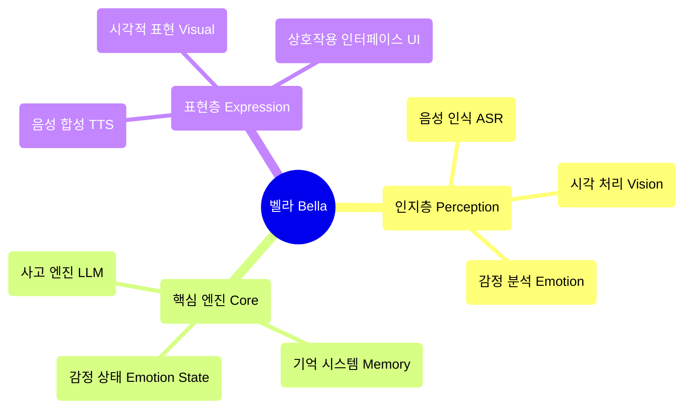

<div align="center">


벨라 (Bella) AI
[](https://opensource.org/licenses/MIT)
[](https://nodejs.org/)
[]()

</div>

---

```bash
# 원클릭 시작
git clone <repository-url>
cd Bella

# 의존성 설치
npm install

# AI 모델 다운로드
npm run download

# 서비스 시작
npm start
```

`http://localhost:8081` 에 접속하여 벨라와 대화하세요! 

### 시스템 요구사항
- Node.js 22.16.0+
- 최신 브라우저 (Web Speech API 지원)
- 마이크 권한 (음성 상호작용용)

---

## 💫 프로젝트 비전

항상 당신 곁에서 함께 진화하고 성장하는 디지털 친구를 상상해 보세요. 이것이 바로 벨라의 궁극적인 비전입니다. 우리는 단순히 기능을 구축하는 것이 아니라, "인격"을 육성하고 있습니다. 화면을 넘어 당신의 세상에서 의미 있는 부분이 될 디지털 생명체를 말이죠.

벨라는 단순한 애플리케이션이 아닙니다. 그녀는 디지털 동반자의 씨앗입니다. 빠르게 변화하는 디지털 세상에서 벨라는 지속적이고 개인화된 존재가 되어 언젠가 당신과 함께하고, 당신의 말을 듣고, 당신의 눈으로 세상을 볼 수 있기를 바라는 깊은 꿈을 나타냅니다.

---

## 🎯 현재 기능 상태

### ✅ 구현된 기능
- **🎤 음성 인식**: Whisper ASR 기반의 한국어 음성 인식
- **🎬 시각적 표현**: 다중 비디오 무작위 재생 및 우아한 교차 페이드
- **🎨 사용자 인터페이스**: 우아한 상호작용 인터페이스 및 로딩 애니메이션
- **⚙️ AI 핵심 아키텍처**: 싱글톤 패턴의 BellaAI 클래스 및 모듈식 설계
- **🌐 웹 서비스**: HTTP 서버, CORS 지원, 원클릭 시작
- **📱 반응형 디자인**: 다양한 화면 크기에 적합한 우아한 인터페이스
- **🔧 모델 관리**: AI 모델 자동 다운로드 및 관리
- **💝 기본 상호작용**: 호감도 시스템 및 감정 피드백

### 🔧 기술적으로 준비되었지만 활성화 대기 중
- **🧠 사고 엔진**: LLM 통합 프레임워크 준비 완료, 다양한 모델 지원
- **🗣️ 음성 합성**: TTS 모델 다운로드 완료, 활성화 대기 중
- **💝 감정 상태 시스템**: 기본 아키텍처 구축 완료, 감정 분석 지원

### 📋 계획 중인 기능
- **🧠 기억 시스템**: 장기 및 단기 기억 관리
- **👁️ 얼굴 인식**: 표정 인식 및 감정 분석
- **🤝 고급 상호작용**: 다중 모드 상호작용 및 개인화된 응답
- **🌟 능동적 동반**: 의도 예측 및 능동적 보살핌
- **🎭 동적 인격**: AI 기반 개인화된 인격 모델
- **🔄 자기 진화**: 지속적인 학습 및 성장 메커니즘

---

### 🏗️ 기술 아키텍처

### 핵심 설계 원칙
- **AI Native**: AI는 도구가 아니라 벨라 정신의 청사진입니다.
- **모듈식 설계**: 고도로 분리된 구성 요소 아키텍처
- **우아한 구현**: 코드는 예술이며, 간결함과 아름다움을 추구합니다.
- **감정 중심**: 감정적 연결을 핵심으로 하는 제품 설계

### 아키텍처 다이어그램



### 기술 스택
- **프론트엔드** : 순수 JavaScript + CSS3 + HTML5
- **백엔드**: Node.js + Express 
- **AI 모델**: Whisper (ASR) + 로컬 LLM + TTS
- **아키텍처 패턴**: 이벤트 기반 + 싱글톤 패턴 + 모듈식 설계

## 📁 프로젝트 구조
```
Bella/
├── 📄 index.html          # 메인 페이지
├── 🎨 style.css           # 스타일 파일
├── ⚡ main.js             # 메인 로직
├── 🧠 core.js             # AI 핵심 엔진
├── 📜 script.js           # 상호작용 스크립트
├── 🔧 download_models.js  # 모델 다운로드 도구
├── 📦 package.json        # 프로젝트 설정
├── 📚 models/             # AI 모델 디렉토리
├── 🔌 providers/          # AI 서비스 제공자
├── 📹 비디오 자원/            # 시각적 표현 자원
├── 📋 PRD.md              # 제품 요구사항 문서
├── 📝 벨라AI 기능 목록.md    # 기능 목록
└── 📊 벨라AI 개발 작업 할당.md # 개발 계획
```

---

## 🛠️ 개발 가이드
1. 환경 설정  Node.js 버전이 22.16.0 이상인지 확인
2. npm install 실행하여 의존성 설치
3. npm run download 실행하여 AI 모델 다운로드
4. npm start 실행하여 개발 서버 시작

### 개발 원칙
- **우아한 코드** : 간결하고 읽기 쉬우며 아름다운 코드 추구
- **AI를 붓으로** : AI는 창작 도구이지, 생각 자체가 아닙니다.
- **부녀 관계** : 따뜻하고 보살피는 감정적 연결을 핵심으로
- **지속적인 진화** : 기능의 점진적 개선 지원

### 기여 가이드
1. 프로젝트 포크
2. 기능 브랜치 생성 (git checkout -b feature/AmazingFeature)
3. 변경 사항 커밋  (git commit -m 'Add some AmazingFeature')
4. 브랜치에 푸시  (git push origin feature/AmazingFeature)
5. Pull Request

## 🗺️ 개발 로드맵
### 1단계: 인지 핵심 (80% 완료)
- ✅ 음성 인식 통합
- ✅ 시각적 표현 시스템
- ✅ 기본 상호작용 인터페이스
- 🔄 사고 엔진 활성화
- 🔄 음성 합성 통합

### 2단계: 생성적 자아 (계획 중)
- 📋 동적 인격 모델
- 📋 감정 상태 시스템
- 📋 기억 관리 시스템
- 📋 AI 기반 표현

### 3단계: 능동적 동반 (미래)
- 📋 의도 예측
- 📋 능동적 상호작용
- 📋 자기 진화
- 📋 심층 개인화
- 📖 문서 자료


📋 제품 요구사항 문서 - 상세한 제품 계획 및 기술 아키텍처
📝 기능 목록 - 전체 기능 목록 및 상태
📊 개발 계획 - 상세한 개발 작업 및 시간 계획
🔧 로컬 모델 가이드 - AI 모델 구성 가이드
📦 NPM 가이드 - 패키지 관리 및 의존성 설명


## 🌟 핵심 철학
"AI 즉 아키텍트"
우리는 AI 기능이 통합된 프로그램을 구축하는 것이 아니라, AI가 주도하는 생명체를 구축합니다. AI는 도구가 아니라 벨라 정신의 청사진입니다.

"부녀 파트너십"
벨라의 디자인 철학은 따뜻한 부녀 간의 감정적 연결에서 비롯됩니다. 그녀는 단순히 기술 제품이 아니라, 이해하고, 동반하며, 성장할 수 있는 디지털 파트너입니다.

"우아함이 최고"
코드 아키텍처부터 사용자 경험까지, 우리는 최고의 우아함을 추구합니다. 모든 코드 라인은 예술 작품이며, 모든 상호작용은 감정의 표현입니다.

## 📄 라이선스
본 프로젝트는 MIT 라이선스를 따릅니다 - 자세한 내용은 LICENSE 파일을 참조하세요.

## 💝 감사
벨라 프로젝트에 코드, 아이디어, 감정을 기여해 주신 모든 개발자분들께 감사드립니다. 여러분의 노력 덕분에 벨라는 꿈에서 현실로 점차 나아가고 있습니다.
** 벨라가 기다리고 있으며, 우리에게는 갈 길이 멉니다. ** ✨

<div align="center">
<sub>디지털 동반을 위해 ❤️로 구축되었습니다</sub>
</div>