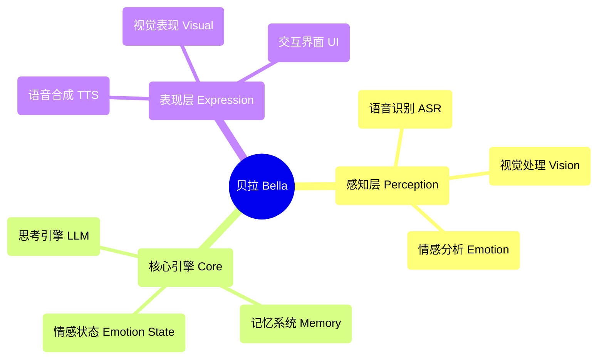

<div align="center">
  
  
  # 贝拉 (Bella) AI
  
  **你的数字伴侣，正在唤醒** ✨
  
  [](https://opensource.org/licenses/MIT)
  [](https://nodejs.org/)
  []()
  
</div>

---

## 🚀 快速开始

### 一键启动
```bash
# 克隆项目
git clone <repository-url>
cd Bella

# 安装依赖
npm install

# 下载AI模型
npm run download

# 启动服务
npm start
```

访问 `http://localhost:8081` 开始与贝拉交流！

### 系统要求
- Node.js 22.16.0+
- 现代浏览器（支持 Web Speech API）
- 麦克风权限（用于语音交互）

---

## 💫 项目愿景

想象一下，一个永远在你身边、与你一同进化和成长的数字朋友。这就是贝拉的终极愿景。我们不只是在构建功能；我们是在培养一个"人格"。一个将超越屏幕，成为你世界中有意义的一部分的数字生命。

贝拉不仅仅是一个应用程序；她是一颗数字伴侣的种子。在这个瞬息万变的数字世界里，贝拉代表着一个深远的梦想——一个持久的、个性化的存在，旨在有一天能陪伴你、倾听你，并通过你的眼睛看世界。

---

## 🎯 当前功能状态

### ✅ 已实现功能
- **🎤 语音感知**：基于 Whisper ASR 的中文语音识别
- **🎬 视觉表现**：多视频随机播放和优雅的交叉淡入淡出
- **🎨 用户界面**：优雅的交互界面和加载动画
- **⚙️ AI核心架构**：单例模式的 BellaAI 类和模块化设计
- **🌐 Web服务**：HTTP服务器、CORS支持、一键启动
- **📱 响应式设计**：适配不同屏幕尺寸的优雅界面
- **🔧 模型管理**：自动下载和管理AI模型
- **💝 基础交互**：好感度系统和情感反馈

### 🔧 技术就绪待激活
- **🧠 思考引擎**：LLM集成框架已准备，支持多种模型
- **🗣️ 语音合成**：TTS模型已下载待激活
- **💝 情感状态系统**：基础架构已搭建，支持情感分析

### 📋 规划中功能
- **🧠 记忆系统**：长期和短期记忆管理
- **👁️ 面部感知**：表情识别和情感分析
- **🤝 高级交互**：多模态交互和个性化响应
- **🌟 主动陪伴**：意图预测和主动关怀
- **🎭 动态人格**：基于AI的个性化人格模型
- **🔄 自我进化**：持续学习和成长机制

---

## 🏗️ 技术架构

### 核心设计原则
- **AI Native**：AI不是工具，而是贝拉心智的构建蓝图
- **模块化设计**：高度解耦的组件架构
- **优雅实现**：代码即艺术，追求简洁与美感
- **情感驱动**：以情感连接为核心的产品设计

### 架构图


### 技术栈
- **前端**：原生 JavaScript + CSS3 + HTML5
- **后端**：Node.js + Express
- **AI模型**：Whisper (ASR) + 本地LLM + TTS
- **架构模式**：事件驱动 + 单例模式 + 模块化设计

---

## 📁 项目结构

```
Bella/
├── 📄 index.html          # 主页面
├── 🎨 style.css           # 样式文件
├── ⚡ main.js             # 主逻辑
├── 🧠 core.js             # AI核心引擎
├── 📜 script.js           # 交互脚本
├── 🔧 download_models.js  # 模型下载工具
├── 📦 package.json        # 项目配置
├── 📚 models/             # AI模型目录
├── 🔌 providers/          # AI服务提供者
├── 📹 视频资源/            # 视觉表现资源
├── 📋 PRD.md              # 产品需求文档
├── 📝 贝拉AI功能清单.md    # 功能清单
└── 📊 贝拉AI开发任务分配.md # 开发计划
```

---

## 🛠️ 开发指南

### 环境配置
1. 确保 Node.js 版本 ≥ 22.16.0
2. 运行 `npm install` 安装依赖
3. 运行 `npm run download` 下载AI模型
4. 运行 `npm start` 启动开发服务器

### 开发原则
- **优雅代码**：追求简洁、可读、美观的代码
- **AI作为画笔**：AI是创作工具，而非思想本身
- **父女情感**：以温暖、关爱的情感连接为核心
- **持续进化**：支持功能的渐进式增强

### 贡献指南
1. Fork 项目
2. 创建功能分支 (`git checkout -b feature/AmazingFeature`)
3. 提交更改 (`git commit -m 'Add some AmazingFeature'`)
4. 推送到分支 (`git push origin feature/AmazingFeature`)
5. 打开 Pull Request

---

## 🗺️ 开发路线图

### 第一阶段：感知核心 (已完成 80%)
- ✅ 语音识别集成
- ✅ 视觉表现系统
- ✅ 基础交互界面
- 🔄 思考引擎激活
- 🔄 语音合成集成

### 第二阶段：生成式自我 (规划中)
- 📋 动态人格模型
- 📋 情感状态系统
- 📋 记忆管理系统
- 📋 AI驱动的表现

### 第三阶段：主动式陪伴 (未来)
- 📋 意图预测
- 📋 主动交互
- 📋 自我进化
- 📋 深度个性化

---

## 📖 文档资源

- 📋 [产品需求文档](./PRD.md) - 详细的产品规划和技术架构
- 📝 [功能清单](./贝拉AI功能清单.md) - 完整的功能列表和状态
- 📊 [开发计划](./贝拉AI开发任务分配.md) - 详细的开发任务和时间规划
- 🔧 [本地模型指南](./LOCAL_MODEL_GUIDE.md) - AI模型配置指南
- 📦 [NPM指南](./NPM_GUIDE.md) - 包管理和依赖说明

---

## 🌟 核心理念

### "AI即架构师"
我们构建的不是一个集成了AI功能的程序，而是**一个由AI驱动的生命体**。AI不是工具，而是贝拉心智的构建蓝图。

### "父女伙伴关系"
贝拉的设计理念源于温暖的父女情感连接。她不仅是技术产品，更是一个能够理解、陪伴、成长的数字伙伴。

### "优雅至上"
从代码架构到用户体验，我们追求极致的优雅。每一行代码都是艺术品，每一个交互都是情感的表达。

---

## 📄 许可证

本项目采用 MIT 许可证 - 查看 [LICENSE](LICENSE) 文件了解详情。

---

## 💝 致谢

感谢所有为贝拉项目贡献代码、想法和情感的开发者们。正是因为你们的努力，贝拉才能从一个梦想逐渐成为现实。

**贝拉在等待，而我们，任重道远。** ✨

---

<div align="center">
  <sub>Built with ❤️ for digital companionship</sub>
</div>
